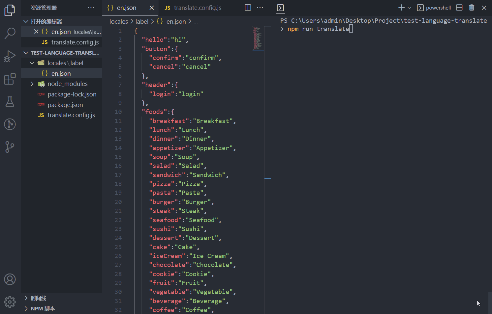

# language-translate

language-translate 是一款基于 Google 翻译在线转换 ts/js/json 多语言文件并批量生成或插入指定文件的插件，支持增量更新，可使用 bash 翻译单个文件，也能集成在项目中持续批量翻译，支持单文件转单文件，单文件转多文件，多文件转多文件，多文件转单文件

[中文](./README.md) ｜ [English](./README_EN.md)
<p align="center">
  <a href="https://github.com/hymhub/language-translate" target="_blank">
    
  </a>
</p>
<p align="center">
  <a href="https://www.npmjs.com/package/language-translate" target="__blank">
    
  </a>
  <a href="https://www.npmjs.com/package/language-translate" target="__blank">
    
  </a>
  <a href="https://github.com/hymhub/language-translate/blob/main/LICENSE" target="__blank">
    
  </a>
</p>
<p align="center">
  <a href="https://github.com/hymhub/language-translate" target="__blank">
    
  </a>
<p>

<p align="center">
  
<p>

## 安装

```bash
  npm i language-translate
```

## 使用

在您的项目根目录下创建 `translate.config.(js|ts)` 进行配置

js 配置示例:
```js
// translate.config.js
import { Lang } from 'language-translate/types';
import { defineConfig } from 'language-translate/utils';

export default defineConfig({
  proxy: {
    host: '127.0.0.1',
    port: 7890,
  },
  fromLang: Lang.en,
  fromPath: 'translate.entry.json',
  translate: [
    {
      label: '将结果翻译到locales文件夹下',
      targetConfig: [
        {
          targetLang: Lang.de,
          outPath: 'locales/de.json',
        },
        {
          targetLang: Lang['zh-CN'],
          outPath: 'locales/zh.json',
        },
        {
          targetLang: Lang.ko,
          outPath: 'locales/ko.json',
        },
      ]
    }
  ]
})
```
在您的项目根目录下创建 `translate.entry.(js|ts|json)` 文件名随意，但需要和配置中 `fromPath` 对应，里面填写您需要翻译的内容，内容所使用语言与配置中 `fromLang` 对应

例如在根目录创建 `translate.entry.json`
```json
{
  "hello": "Hello {{name}}, how are you today?",
  "button": {
    "confirm": "confirm",
    "cancel": "cancel"
  },
  "header": {
    "login": "login"
  }
}
```
注意: 翻译后会在结果保留 i18n 中的插值表达式，例如上述 `{{name}}` 但仅支持 `{{}}` 这一种语法

在 `package.json` 中加入 scripts 命令

```json
"scripts": {
  "translate": "translate"
}
```

在终端执行命令启动翻译

```bash
npm run translate
```

不出意外已经可以在根目录下 `locales` 内看到 `de.json`、`ko.json`、`zh.json`

```md
|-- Your Project Name
  |-- locales
    |-- de.json
    |-- ko.json
    |-- zh.json
  |-- package.json
  |-- translate.config.js
  |-- translate.entry.json
```

此后有新文案需要翻译时，只需要修改 `fromPath` 文件内容(即示例中`translate.entry.json`)，再执行 `npm run translate` 即可实现增量更新

## 高级用法
配置中的 `fromPath` 是基于 [fast-glob](https://github.com/mrmlnc/fast-glob#pattern-syntax) 的，所以支持动态解析，例如递归翻译整个文件夹下以 `.en.json` 结尾的文件
```js
// translate.config.js
import { Lang } from 'language-translate/types';
import { defineConfig } from 'language-translate/utils';

export default defineConfig({
  proxy: {
    host: '127.0.0.1',
    port: 7890,
  },
  fromLang: Lang.en,
  fromPath: 'locales/**/*.en.json',
  translate: [
    {
      label: '递归翻译文件夹内json文件并重写文件名',
      targetConfig: [
        {
          targetLang: Lang.de,
          outPath: 'locales',
          rewrite: fileName => fileName.replace('.en.json', '.de.json'),
        },
        {
          targetLang: Lang['zh-CN'],
          outPath: 'locales',
          rewrite: fileName => fileName.replace('.en.json', '.zh.json'),
        },
        {
          targetLang: Lang.ko,
          outPath: 'locales',
          rewrite: fileName => fileName.replace('.en.json', '.ko.json'),
        },
      ]
    },
  ]
})
```
翻译前 `locales` 目录结构
```md
locales
├─com.en.json
├─header.en.json
├─children
|    ├─color.en.json
```
翻译后 `locales` 目录结构
```md
locales
├─com.de.json
├─com.en.json
├─com.ko.json
├─com.zh.json
├─header.de.json
├─header.en.json
├─header.ko.json
├─header.zh.json
├─children
|    ├─color.de.json
|    ├─color.en.json
|    ├─color.ko.json
|    └─color.zh.json
```

也可以将翻译结果输出到另一个文件夹，只需要更改 `outPath` 即可，更多用法等你解锁哦，也可结合[FAQ](#faq)输出可选做出更多花样，项目 [example](https://github.com/hymhub/language-translate/tree/main/example) 目录中也提供了一些简单示例

## 配置API

### `translate.config.(js|ts)`

| 属性 | 描述 | 类型 | 默认值 | 必填 |
| :-: | :-- | :-: | :-: | :-: |
| `toolsLang` | 翻译工具在使用过程中终端输出的提示语言 | `en` \| `zh-CN` | `zh-CN` | 否 |
| `proxy` | 使用 Google 翻译，需要网络代理，如果您所在的国家能直接使用 Google 就可以不填 proxy 配置项 | [Proxy](#proxy) | `undefined` | 否 |
| `fromLang` | 待翻译文件所使用语言 | [Lang](#lang) | - | 是 |
| `fromPath` | 待翻译文件路径，基于 [fast-glob](https://github.com/mrmlnc/fast-glob#pattern-syntax)，支持动态解析，后缀名可以是 js\|ts\|json | string | `translate.entry.json` | 否 |
| `translate` | 翻译输出配置，可配置多项在开始翻译时进行选择 | [Translate](#translate)[] | - | 是 |
| `incrementalMode` | 增量更新模式(翻译完成后修改 fromPath 对应文件内容再次启动翻译的处理策略，详见[IncrementalMode](#incrementalmode)) | [IncrementalMode](#incrementalmode) | `IncrementalMode.cover` | 否 |
| `translateRuntimeDelay` | 翻译过程中每个 key 之间的延迟，单位毫秒 | number | `0` | 否 |
| `translateRuntimeChunkSize` | 翻译过程中每隔多少个 key 将翻译结果同步写入一下硬盘，防止意外中断导致浪费已翻译的 key | number | `5` | 否 |
| `translateRuntimeMergeEnabled` | 在翻译运行时启用文案合并功能，减少 API 调用频率，显著提升翻译速度  | boolean | `true` | 否 |
| `mergeEnabledChunkValuesLength` | 在启用文案合并功能时限制单个合并文案的最长字符数，不要超过5000，因为 Google 翻译单次翻译字符最大限制5000  | number | `5000` | 否 |
| `ignoreValuesAndCopyToTarget` | 排除`fromPath`文件中指定的文案并直接拷贝到目标文件内 | string[] | `[]` | 否 |
| `apiKeyConfig` | 用于配置非 Google 翻译的密钥信息，目前只扩展了百度翻译接口 | [ApiKeyConfig](#apikeyconfig)  | `undefined` | 否 |

### `Proxy`

| 属性 | 描述 | 类型 |
| :-: | :--: | :-: |
| `host` | 代理主机地址 | string |
| `port` | 代理主机端口 | number |

### `Translate`

| 属性 | 描述 | 类型 |
| :-: | :--: | :-: |
| `label` | 自定义名称，当 `translate` 配置项有多项的时候，启动翻译时会在终端提示进行选择让翻译更加工程化，具体演示: [FAQ](#faq) | string |
| `targetConfig` | 翻译输出配置 | [TargetConfig](#targetconfig) |

### `TargetConfig`

| 属性 | 描述 | 类型 | 必填 |
| :-: | :--: | :-: | :-: |
| `targetLang` | 翻译输出的目标语言 | [Lang](#lang) | 是 |
| `outPath` |  翻译后文件输出路径，后缀名可以是js\|ts\|json，也可以是目录，输出时如果没有目标文件则自动生成，如果有则增量更新 | string | 是 |
| `rewrite` | 可选值，传入回调函数可在输出时重写文件名，形参会传入原始文件名，返回值是最终输出文件名 | Callback<br/>`(fileName: string) => string;` | 否 |

### `IncrementalMode`
| 值 | 描述 |
| :-: | :--: |
| `cover` | 覆盖模式: 目标文件中已有的 key 直接覆盖，没有的 key 新增  |
| `fast` | 快速模式: 目标文件中已有 key 并且值不为空在翻译时会排除, 否则新增 key, 如果不理解可以去项目 [example](https://github.com/hymhub/language-translate/tree/main/example) 目录查看例子 |

### `ApiKeyConfig`
用于配置非 Google 翻译的密钥信息，百度翻译API免费版限制请求频率，非常鸡肋，非要用百度建议使用付费高级版
```typescript
export enum TranslateService {
  baidu = 'baidu',
  google = 'google',
}
export interface BaiduApiKeyConfig {
  appId: string
  appKey: string
}
export interface ApiKeyConfig {
  type: TranslateService
  [TranslateService.baidu]?: BaiduApiKeyConfig
}
```

### `Lang`

| 语言 | 翻译代码 |
| :-: | :-: |
| 中文(简体)  | zh-CN |
| 中文(繁體)  | zh-TW |
| 英语  | en    |
| 南非荷兰语  | af    |
| 阿尔巴尼亚语  | sq    |
| 阿姆哈拉语  | am    |
| 阿拉伯语  | ar    |
| 亚美尼亚语  | hy    |
| 阿塞拜疆语  | az    |
| 巴斯克语  | eu    |
| 白俄罗斯语  | be    |
| 孟加拉语  | bn    |
| 波斯尼亚语  | bs    |
| 保加利亚语  | bg    |
| 加泰罗尼亚语  | ca    |
| 宿雾语  | ceb   |
| 奇切瓦语  | ny    |
| 科西嘉语  | co    |
| 克罗地亚语  | hr    |
| 捷克语  | cs    |
| 丹麦语  | da    |
| 荷兰语  | nl    |
| 世界语  | eo    |
| 爱沙尼亚语  | et    |
| 菲律宾语  | tl    |
| 芬兰语  | fi    |
| 法语  | fr    |
| 弗里斯兰语  | fy    |
| 加利西亚语  | gl    |
| 格鲁吉亚语  | ka    |
| 德语  | de    |
| 希腊语  | el    |
| 古吉拉特语  | gu    |
| 海地克里奥尔语  | ht    |
| 夏威夷语  | haw   |
| 希伯来语  | iw    |
| 印地语  | hi    |
| 苗语  | hmn   |
| 匈牙利语  | hu    |
| 冰岛语  | is    |
| 伊博语  | ig    |
| 印度尼西亚语  | id    |
| 爱尔兰语  | ga    |
| 意大利语  | it    |
| 日语  | ja    |
| 爪哇语  | jw    |
| 卡纳达语  | kn    |
| 哈萨克语  | kk    |
| 高棉语  | km    |
| 韩语  | ko    |
| 库尔德语  | ku    |
| 吉尔吉斯语  | ky    |
| 老挝语  | lo    |
| 拉丁语  | la    |
| 拉脱维亚语  | lv    |
| 立陶宛语  | lt    |
| 卢森堡语  | lb    |
| 马其顿语  | mk    |
| 马达加斯加语  | mg    |
| 马来语  | ms    |
| 马拉雅拉姆语  | ml    |
| 马耳他语  | mt    |
| 毛利语  | mi    |
| 马拉地语  | mr    |
| 蒙古语  | mn    |
| 缅甸语  | my    |
| 尼泊尔语  | ne    |
| 挪威语  | no    |
| 普什图语  | ps    |
| 波斯语  | fa    |
| 波兰语  | pl    |
| 葡萄牙语  | pt    |
| 旁遮普语  | pa    |
| 罗马尼亚语  | ro    |
| 俄语  | ru    |
| 萨摩亚语  | sm    |
| 苏格兰盖尔语  | gd    |
| 塞尔维亚语  | sr    |
| 塞索托语  | st    |
| 绍纳语  | sn    |
| 信德语  | sd    |
| 僧伽罗语  | si    |
| 斯洛伐克语  | sk    |
| 斯洛文尼亚语  | sl    |
| 索马里语  | so    |
| 西班牙语  | es    |
| 巽他语  | su    |
| 斯瓦希里语  | sw    |
| 瑞典语  | sv    |
| 塔吉克语  | tg    |
| 泰米尔语  | ta    |
| 泰卢固语  | te    |
| 泰语  | th    |
| 土耳其语  | tr    |
| 乌克兰语  | uk    |
| 乌尔都语  | ur    |
| 乌兹别克语  | uz    |
| 越南语  | vi    |
| 威尔士语  | cy    |
| 科萨语  | xh    |
| 依地语  | yi    |
| 约鲁巴语  | yo    |
| 祖鲁语  | zu    |

如果 `Lang` 配置中没有您需要的语言，您可以直接传入 Google 翻译支持的语言代码

## FAQ

`translate` 配置项配置多项的适用场景
在开发中，`locales` 文件夹下可能会有专门存放错误码、业务文案的文件夹，甚至多种模块，例如:
```
|-- Your Project Name
  |-- locales
    |-- error
      |-- de.json
      |-- ko.json
      |-- zh.json
    |-- label
      |-- de.json
      |-- ko.json
      |-- zh.json
```
此时在待翻译文件填入错误码文案内容，例如 `translate.entry.json`
```json
{
  "0": "service error",
  "4": "client error",
}
```
现在我们只想让翻译后的结果插入 `locales/error` 目录下，只需在 `translate` 配置项添加多个选项后再启动翻译，这时终端会提示让您进行选择:
```js
// translate.config.js
import { Lang } from 'language-translate/types';
import { defineConfig } from 'language-translate/utils';

export default defineConfig({
  proxy: {
    host: '127.0.0.1',
    port: 7890,
  },
  fromLang: Lang.en,
  fromPath: 'translate.entry.json',
  translate: [
    {
      label: '将结果翻译到locales/error文件夹下',
      targetConfig: [
        {
          targetLang: Lang.de,
          outPath: 'locales/error/de.json',
        },
        {
          targetLang: Lang['zh-CN'],
          outPath: 'locales/error/zh.json',
        },
        {
          targetLang: Lang.ko,
          outPath: 'locales/error/ko.json',
        },
      ]
    },
    {
      label: '将结果翻译到locales/label文件夹下',
      targetConfig: [
        {
          targetLang: Lang.de,
          outPath: 'locales/label/de.json',
        },
        {
          targetLang: Lang['zh-CN'],
          outPath: 'locales/label/zh.json',
        },
        {
          targetLang: Lang.ko,
          outPath: 'locales/label/ko.json',
        },
      ]
    },
  ]
})
```
终端执行
```bash
npm run translate
```
<p></p>

此时已实现翻译输出可选功能

## 在 bash 中使用

language-translate 也支持在 bash 中翻译单个文件
```bash
npm i language-translate -g
```
直接在 bash 执行
```bash
translate -i /User/xxx/source.json -o /User/xxx/target.json -f en -t zh-CN -h 127.0.0.1 -p 7890
```
您也可以输入 `translate --help` 获取帮助
```bash
translate --help
# 终端输出
Usage: translate [options]

Translate a single js/ts/json file

Options:
  -i, --input <string>     source file path
  -o, --output <string>    target file path
  -f, --fromlang <Lang>    source file language
  -t, --targetlang <Lang>  target file language
  -h, --host <string>      proxy host
  -p, --port <string>      proxy port
  --help                   display help for command
```
