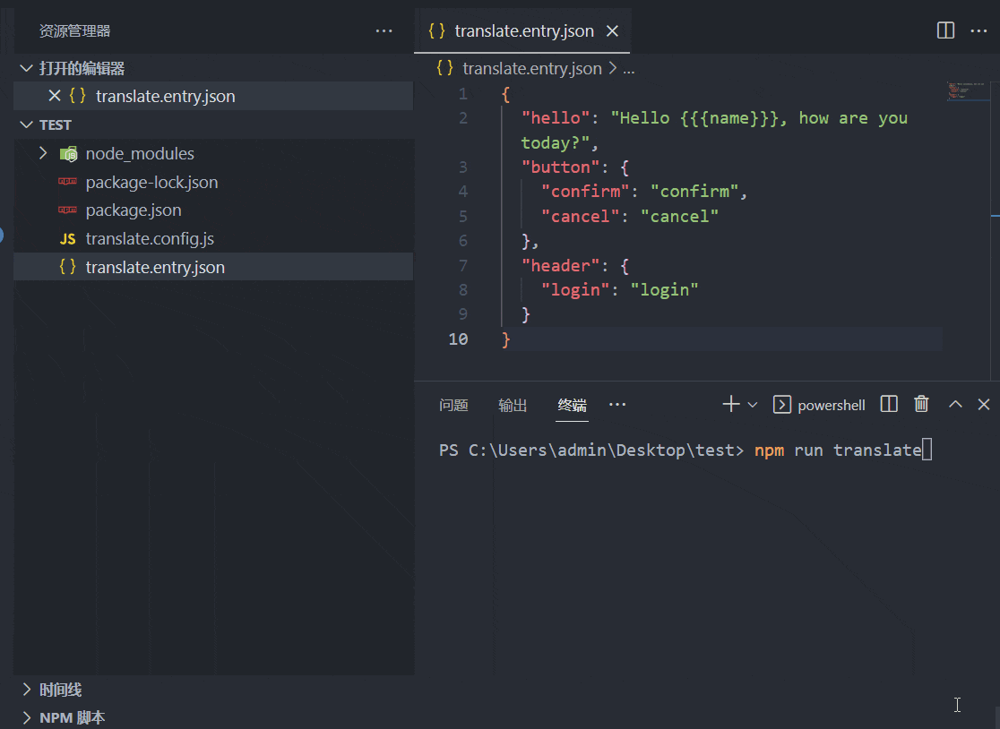
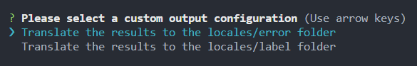

# language-translate

language-translate is a plug-in that converts ts/js/json multilingual files online based on Google Translate and generates or inserts specified files in batches. It supports incremental updates, can use bash to translate a single file, and can also be integrated in the project for continuous batch translation , support single file to single file, single file to multiple files, multiple files to multiple files, multiple files to single file

[中文](./README.md) ｜ [English](./README_EN.md)
<p align="center">
  <a href="https://github.com/hymhub/language-translate" target="_blank">
    
  </a>
</p>
<p align="center">
  <a href="https://www.npmjs.com/package/language-translate" target="__blank">
    
  </a>
  <a href="https://www.npmjs.com/package/language-translate" target="__blank">
    
  </a>
  <a href="https://github.com/hymhub/language-translate/blob/main/LICENSE" target="__blank">
    
  </a>
</p>
<p align="center">
  <a href="https://github.com/hymhub/language-translate" target="__blank">
    
  </a>
<p>

<p align="center">
  
<p>

## Install

```bash
  npm i language-translate
```

## Usage

Create `translate.config.(js|ts)` in your project root directory for configuration

js Configuration example:
```js
// translate.config.js
import { Lang } from 'language-translate/types';
import { defineConfig } from 'language-translate/utils';

export default defineConfig({
  toolsLang: 'en',
  proxy: {
    host: '127.0.0.1',
    port: 7890,
  },
  fromLang: Lang.en,
  fromPath: 'translate.entry.json',
  translate: [
    {
      label: 'Translate the results to the locales folder',
      targetConfig: [
        {
          targetLang: Lang.de,
          outPath: 'locales/de.json',
        },
        {
          targetLang: Lang['zh-CN'],
          outPath: 'locales/zh.json',
        },
        {
          targetLang: Lang.ko,
          outPath: 'locales/ko.json',
        },
      ]
    }
  ]
})
```
Create `translate.entry.(js|ts|json)` in the root directory of your project. The file name is optional, but it needs to correspond to `fromPath` in the configuration. Fill in the content you need to translate, the language used in the content and the configuration `fromLang` corresponds to

For example, in the root directory create `translate.entry.json`
```json
{
  "hello": "Hello {{{name}}}, how are you today?",
  "button": {
    "confirm": "confirm",
    "cancel": "cancel"
  },
  "header": {
    "login": "login"
  }
}
```
Note: After translation, the interpolation expression in i18n will be retained in the result, such as the above `{{name}}` but only `{{}}` is supported

Add scripts command to `package.json`

```json
"scripts": {
  "translate": "translate"
}
```

Execute the command at the terminal to start the translation

```bash
npm run translate
```

Not surprisingly, you can already see `de.json`, `ko.json`, `zh.json` in `locales` in the root directory

```md
|-- Your Project Name
  |-- locales
    |-- de.json
    |-- ko.json
    |-- zh.json
  |-- package.json
  |-- translate.config.js
  |-- translate.entry.json
```

Afterwards, when there is a new copy that needs to be translated, you only need to modify the content of the `fromPath` file (that is, `translate.entry.json` in the example), and then execute `npm run translate` to achieve incremental updates

## Advanced usage

The `fromPath` in the configuration is based on [fast-glob](https://github.com/mrmlnc/fast-glob#pattern-syntax), so it supports dynamic analysis, such as recursively translating the whole folder with `.en.json` end of file

```js
// translate.config.js
import { Lang } from 'language-translate/types';
import { defineConfig } from 'language-translate/utils';

export default defineConfig({
  toolsLang: 'en',
  proxy: {
    host: '127.0.0.1',
    port: 7890,
  },
  fromLang: Lang.en,
  fromPath: 'locales/**/*en.json',
  translate: [
    {
      label: 'Recursively translate json files in folders and rewrite file names',
      targetConfig: [
        {
          targetLang: Lang.de,
          outPath: 'locales',
          rewrite: fileName => fileName.replace('.en.json', '.de.json'),
        },
        {
          targetLang: Lang['zh-CN'],
          outPath: 'locales',
          rewrite: fileName => fileName.replace('.en.json', '.zh.json'),
        },
        {
          targetLang: Lang.ko,
          outPath: 'locales',
          rewrite: fileName => fileName.replace('.en.json', '.ko.json'),
        },
      ]
    },
  ]
})
```
`locales` directory structure before translation
```md
locales
├─com.en.json
├─header.en.json
├─children
|    ├─color.en.json
```
The translated `locales` directory structure
```md
locales
├─com.de.json
├─com.en.json
├─com.ko.json
├─com.zh.json
├─header.de.json
├─header.en.json
├─header.ko.json
├─header.zh.json
├─children
|    ├─color.de.json
|    ├─color.en.json
|    ├─color.ko.json
|    └─color.zh.json
```

You can also output the translation results to another folder, just change the `outPath`, more usages are waiting for you to unlock, you can also combine [FAQ](#faq) output selection to make more tricks, the project [example](https://github.com/hymhub/language-translate/tree/main/example) directory also provides some simple examples

## Config API

### `translate.config.(js|ts)`

| Attribute | Description | Type | Default | Required |
| :-: | :-- | :-: | :-: | :-: |
| `toolsLang` | The prompt language output by the terminal during the use of the translation tool | `en` \| `zh-CN` | `zh-CN` | No |
| `proxy` | To use Google Translate, a network proxy is required. If your country can directly use Google, you don’t need to fill in the proxy configuration item | [Proxy](#proxy) | `undefined` | No |
| `fromLang` | The language of the document to be translated | [Lang](#lang) | - | Yes |
| `fromPath` | The path of the file to be translated, based on [fast-glob](https://github.com/mrmlnc/fast-glob#pattern-syntax), supports dynamic parsing, and the suffix name can be js\|ts\|json | string | `translate.entry.json` | No |
| `translate` | Translation output configuration, multiple options can be configured when starting translation | [Translate](#translate)[] | - | Yes |
| `incrementalMode` | Incremental update mode (after the translation is completed, modify the file content corresponding to fromPath and restart the translation processing strategy, see [IncrementalMode](#incrementalmode)) | [IncrementalMode](#incrementalmode) | `IncrementalMode.cover` | No |
| `translateRuntimeDelay` | The delay between each key during translation, in milliseconds | number | `0` | No |
| `translateRuntimeChunkSize` | During the translation process, write the translation results to the hard disk synchronously every few keys to prevent accidental interruption and waste the translated keys | number | `5` | No |
| `translateRuntimeMergeEnabled` | Enable the text merge function when the translation is running, reducing the frequency of API calls and significantly improving the translation speed | boolean | `true` | No |
| `mergeEnabledChunkValuesLength` | Limit the maximum number of characters of a single merged text when the text merging function is enabled, and it should not exceed 5000, because Google Translate has a maximum limit of 5000 characters for a single translation | number | `5000` | No |
| `ignoreValuesAndCopyToTarget` | Exclude the text specified in the `fromPath` file and directly copy it into the target file | string[] | `[]` | No |
| `apiKeyConfig` | Used to configure key information for non-Google translations, currently only expands the Baidu translation interface | [ApiKeyConfig](#apikeyconfig) | `undefined` | No |

### `Proxy`

| Attribute | Description | Type |
| :-: | :--: | :-: |
| `host` | proxy host address | string |
| `port` | proxy host port | number |

### `Translate`

| Attribute | Description | Type |
| :-: | :--: | :-: |
| `label` | Customize the name. When there are multiple `translate` configuration items, when the translation is started, the terminal will prompt you to make a choice to make the translation more engineering. The specific demonstration: [FAQ](#faq) | string |
| `targetConfig` | Translation output configuration | [TargetConfig](#targetconfig) |

### `TargetConfig`

| Attribute | Description | Type | Required |
| :-: | :--: | :-: | :-: |
| `targetLang` | Target language for translation output | [Lang](#lang) | Yes |
| `outPath` | The output path of the translated file. The suffix name can be js\|ts\|json or a directory. If there is no target file during output, it will be automatically generated, and if there is, it will be incrementally updated | string | Yes |
| `rewrite` | Optional value, the callback function can be passed in to rewrite the file name when outputting, the formal parameter will pass in the original file name, and the return value is the final output file name | Callback<br/>`(fileName: string) => string;` | No |

### `IncrementalMode`
| Value | Description |
| :-: | :--: |
| `cover` | cover mode: The existing keys in the target file are directly overwritten, and the keys that do not exist are added |
| `fast` | fast mode: If there is an existing key in the target file and the value is not empty, it will be excluded during translation, otherwise add a new key, if you don’t understand it, you can go to the project [example](https://github.com/hymhub/language-translate/tree/main/example) directory to view examples |

### `ApiKeyConfig`
It is used to configure the key information of non-Google translations. The free version of Baidu Translation API limits the request frequency, which is very tasteless. If you have to use Baidu, it is recommended to use the paid premium version
```typescript
export enum TranslateService {
  baidu = 'baidu',
  google = 'google',
}
export interface BaiduApiKeyConfig {
  appId: string
  appKey: string
}
export interface ApiKeyConfig {
  type: TranslateService
  [TranslateService.baidu]?: BaiduApiKeyConfig
}
```

### `Lang`

| Language | Translation Code |
| :-: | :-: |
| Chinese(Simplified)  | zh-CN |
| Chinese(Traditional)  | zh-TW |
| English  | en    |
| Afrikaans  | af    |
| Albanian  | sq    |
| Amharic  | am    |
| Arabic  | ar    |
| Armenian  | hy    |
| Azerbaijani  | az    |
| Basque  | eu    |
| Belarusian  | be    |
| Bengali  | bn    |
| Bosnian  | bs    |
| Bulgarian  | bg    |
| Catalan  | ca    |
| Cebuano  | ceb   |
| Chichewa  | ny    |
| Corsican  | co    |
| Croatian  | hr    |
| Czech  | cs    |
| Danish  | da    |
| Dutch  | nl    |
| Esperanto  | eo    |
| Estonian  | et    |
| Filipino  | tl    |
| Finnish  | fi    |
| French  | fr    |
| Frisian  | fy    |
| Galician  | gl    |
| Georgian  | ka    |
| German  | de    |
| Greek  | el    |
| Gujarati  | gu    |
| Haitian Creole  | ht    |
| Hawaiian  | haw   |
| Hebrew  | iw    |
| Hindi  | hi    |
| Hmong  | hmn   |
| Hungarian  | hu    |
| Icelandic  | is    |
| Igbo  | ig    |
| Indonesian  | id    |
| Irish  | ga    |
| Italian  | it    |
| Japanese  | ja    |
| Javanese  | jw    |
| Kannada  | kn    |
| Kazakh  | kk    |
| Khmer  | km    |
| Korean  | ko    |
| Kurdish  | ku    |
| Kyrgyz  | ky    |
| Lao  | lo    |
| Latin  | la    |
| Latvian  | lv    |
| Lithuanian  | lt    |
| Luxembourgish  | lb    |
| Macedonian  | mk    |
| Malagasy  | mg    |
| Malay  | ms    |
| Malayalam  | ml    |
| Maltese  | mt    |
| Maori  | mi    |
| Marathi  | mr    |
| Mongolian  | mn    |
| Myanmar (Burmese)  | my    |
| Nepali  | ne    |
| Norwegian  | no    |
| Pashto  | ps    |
| Persian  | fa    |
| Polish  | pl    |
| Portuguese  | pt    |
| Punjabi  | pa    |
| Romanian  | ro    |
| Russian  | ru    |
| Samoan  | sm    |
| Scots Gaelic  | gd    |
| Serbian  | sr    |
| Sesotho  | st    |
| Shona  | sn    |
| Sindhi  | sd    |
| Sinhala  | si    |
| Slovak  | sk    |
| Slovenian  | sl    |
| Somali  | so    |
| Spanish  | es    |
| Sundanese  | su    |
| Swahili  | sw    |
| Swedish  | sv    |
| Tajik  | tg    |
| Tamil  | ta    |
| Telugu  | te    |
| Thai  | th    |
| Turkish  | tr    |
| Ukrainian  | uk    |
| Urdu  | ur    |
| Uzbek  | uz    |
| Vietnamese  | vi    |
| Welsh  | cy    |
| Xhosa  | xh    |
| Yiddish  | yi    |
| Yoruba  | yo    |
| Zulu  | zu    |

If the language you need is not in the `Lang` configuration, you can directly pass in the language code supported by Google Translate

## FAQ

Applicable scenarios for configuring multiple `translate` configuration items
During development, there may be folders dedicated to storing error codes, business copywriting, and even various modules under the `locales` folder, such as:
```
|-- Your Project Name
  |-- locales
    |-- error
      |-- de.json
      |-- ko.json
      |-- zh.json
    |-- label
      |-- de.json
      |-- ko.json
      |-- zh.json
```
At this time, fill in the content of the error code copy in the file to be translated, for example `translate.entry.json`
```json
{
  "0": "service error",
  "4": "client error",
}
```
Now we only want to insert the translated results into the `locales/error` directory, just add multiple options to the `translate` configuration item and then start the translation, then the terminal will prompt you to choose:
```js
// translate.config.js
import { Lang } from 'language-translate/types';
import { defineConfig } from 'language-translate/utils';

export default defineConfig({
  toolsLang: 'en',
  proxy: {
    host: '127.0.0.1',
    port: 7890,
  },
  fromLang: Lang.en,
  fromPath: 'translate.entry.json',
  translate: [
    {
      label: 'Translate the results to the locales/error folder',
      targetConfig: [
        {
          targetLang: Lang.de,
          outPath: 'locales/error/de.json',
        },
        {
          targetLang: Lang['zh-CN'],
          outPath: 'locales/error/zh.json',
        },
        {
          targetLang: Lang.ko,
          outPath: 'locales/error/ko.json',
        },
      ]
    },
    {
      label: 'Translate the results to the locales/label folder',
      targetConfig: [
        {
          targetLang: Lang.de,
          outPath: 'locales/label/de.json',
        },
        {
          targetLang: Lang['zh-CN'],
          outPath: 'locales/label/zh.json',
        },
        {
          targetLang: Lang.ko,
          outPath: 'locales/label/ko.json',
        },
      ]
    },
  ]
})
```
terminal execution
```bash
npm run translate
```
<p></p>

The translation output optional function has been realized at this time

## In bash use

language-translate also supports translation of individual files in bash
```bash
npm i language-translate -g
```
Execute directly in bash
```bash
translate -i /User/xxx/source.json -o /User/xxx/target.json -f en -t zh-CN -h 127.0.0.1 -p 7890
```
You can also type `translate --help` for help
```bash
translate --help
# terminal output
Usage: translate [options]

Translate a single js/ts/json file

Options:
  -i, --input <string>     source file path
  -o, --output <string>    target file path
  -f, --fromlang <Lang>    source file language
  -t, --targetlang <Lang>  target file language
  -h, --host <string>      proxy host
  -p, --port <string>      proxy port
  --help                   display help for command
```
